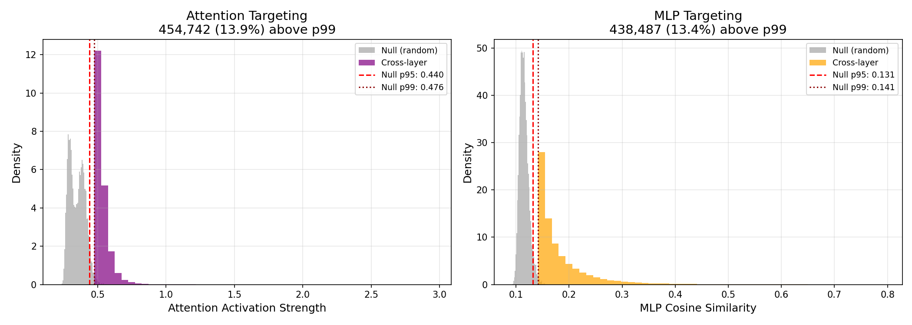

# Cross-Layer Connections in Cross-Layer Transcoders: An Empirical Investigation

**Research Question**: How big a deal are the cross-layer connections in cross-layer transcoders? What are they really doing?

**Model**: Gemma Scope 2 CLTs on Gemma 2 2B

---

# Executive Summary

Cross-Layer Transcoders (CLTs) allow features at layer ℓ to write directly to all subsequent layers ℓ+1, ..., L. We investigated whether these cross-layer connections are meaningful or just architectural artifacts.

## The Core Finding

CLT cross-layer decoder vectors are **systematically aligned** with specific downstream model components—14× more than expected by chance.

We scanned all **3.28 million** cross-layer decoder vectors and found:

| Component | Above Null p99 | Expected by Chance |
|-----------|----------------|-------------------|
| Attention (Query) | **13.81%** | 1% |
| MLP (Gate) | **13.76%** | 1% |

**Key discoveries:**

1. **Attention Bottleneck at Layer 19**: 35% of all significant attention targeters converge on a single layer
2. **Precision Targeting**: Layer 21 Head 2 receives the strongest targeting (6.2× null threshold) from features across 19 source layers
3. **MLP Hub Neurons**: Single neurons in L3/L4 are targeted by ~9,000 features each
4. **Suppression**: Many top MLP targeters have negative cosine—features both activate and inhibit

## What Cross-Layer Connections Are NOT Doing

We tested and ruled out simpler explanations:

| Hypothesis | Experiment | Result | Conclusion |
|------------|------------|--------|------------|
| "They're just shortcuts" | Exp 6: Residual Alignment | Cosine with ΔR ≈ 0 | ❌ They don't approximate the residual transformation |
| "They predict tokens early" | Exp 5: Logit Lens | 0/100 token match | ❌ Cross-layer writes predict different tokens than same-layer |
| "Same-layer does the real work" | Exp 2: Ablation | +52% FVU when ablated | ❌ Cross-layer carries essential information |
| "Cross-layer dominates by weight" | Exp 1: Normalization | Same-layer 3× stronger per-connection | ❌ Cross-layer is numerous but individually weaker |

## What Cross-Layer Connections ARE Doing

The evidence points to **targeted, functional wiring**:

| Finding | Experiment | Implication |
|---------|------------|-------------|
| 14% target specific components | Exp 7b/7c | Intentional structure, not noise |
| 35% converge on Layer 19 | Exp 7b | Attention routing bottleneck |
| L21 Head 2 precision targeting | Exp 7b | Coordinated control of specific head |
| Hub neurons (9k features → 1 neuron) | Exp 7c | Computational bottlenecks |
| Features span 12 layers average | Exp 9 | Path collapsing confirmed |
| Decay with distance but persist | Exp 4 | Long-range connections are real |

## The Tradeoff

Comparing CLTs to per-layer transcoders (Exp 9):

| Metric | CLT | Per-Layer TC |
|--------|-----|--------------|
| Reconstruction (FVU) | 22.19% | 13.67% |
| Feature span | 12 layers | 1 layer |

CLTs sacrifice ~40% reconstruction fidelity to enable path collapsing—single features representing what would require chains of per-layer features.

## Bottom Line

Cross-layer connections create "virtual weights" that:
- **Route attention** at specific bottleneck layers (L19)
- **Trigger/suppress MLP computations** at hub neurons
- **Collapse multi-hop circuits** into single features

This is structural evidence supporting Anthropic's claim that CLTs reduce circuit path length by creating direct connections between distant components. The targeting is too systematic (14× chance) and too concentrated (35% → one layer, 9k features → one neuron) to be architectural accident.

---

# Experiments in Depth

## Experiment 1: Cross-Layer Weight Analysis

**Goal**: Quantify how much decoder weight mass is in cross-layer vs same-layer connections.

| Metric | Same-Layer | Cross-Layer |
|--------|------------|-------------|
| Connection count | 26 | 325 |
| Total norm | 9.83 | 40.71 |
| **Raw ratio** | 19.46% | **80.54%** |
| Avg norm per connection | 0.378 | 0.125 |
| **Normalized ratio** | **75.12%** | 24.88% |

**Critical Insight**: The raw 80% figure is misleading. There are 12.5x more cross-layer connections than same-layer connections structurally. When normalized per-connection, **same-layer connections are 3x stronger** (0.378 vs 0.125 avg norm).

---

## Experiment 2: Ablation Study

**Goal**: Measure the functional impact of removing cross-layer connections.

| Condition | FVU |
|-----------|-----|
| Full CLT | 28.65% |
| Cross-layer ablated | 43.73% |
| **Degradation** | +15.08% (52.6% relative) |

Removing cross-layer connections significantly degrades reconstruction, confirming they carry meaningful information beyond same-layer connections.

---

## Experiment 4: Layer Distance Analysis

**Goal**: Analyze how cross-layer connection strength varies with distance.

**Findings**:
- Decoder norm decays with layer distance
- Decay factor (distance 0→5): **0.34** (from 0.378 to 0.130)
- Long tail remains significant—distant connections are weaker but present

---

## Experiment 5: Time Travel Logit Lens

**Goal**: Do cross-layer writes predict the final token earlier than their source layer?

**Method**: Compare logit predictions from same-layer vs cross-layer decoder vectors through the unembedding matrix.

| Metric | Value |
|--------|-------|
| Average logit similarity | -0.003 |
| Same top token prediction | **0/100** |

**Interpretation**: Cross-layer writes predict completely different tokens than same-layer writes. Features don't "predict ahead"—they contribute to different semantic subspaces at different layers.

---

## Experiment 6: Residual Stream Alignment

**Goal**: Do cross-layer writes approximate the residual stream transformation between layers?

**Method**: Compare cross-layer decoder vectors to ΔR = R_out - R_in.

| Metric | Value |
|--------|-------|
| Global average alignment | -0.0029 |
| Top aligned feature | ~0.04 |

**Interpretation**: Cross-layer connections do NOT shortcut the residual stream transformation. They add orthogonal information rather than approximating what intermediate layers would compute.

---

## Experiment 7b: Full Attention Targeting Scan

**Goal**: Identify which layers and heads cross-layer features target.

**Method**: Scan all 3.28M cross-layer decoder vectors, compute activation strength on each attention head's W_Q, compare to null baseline of random vectors.

### Results

| Metric | Value |
|--------|-------|
| Vectors scanned | 3,276,000 |
| Above null p99 | 452,468 (**13.81%**) |
| Null p99 threshold | 0.476 |

### Target Layer Distribution

| Layer | Targeters | % of Total | Notes |
|-------|-----------|------------|-------|
| **L19** | **158,243** | **35.0%** | Mass convergence |
| L23 | 92,650 | 20.5% | Secondary |
| L17 | 45,177 | 10.0% | |
| L25 | 42,840 | 9.5% | Final layer |
| L21 | 11,196 | 2.5% | Strongest targeters |

### Precision Targeting: Layer 21 Head 2

The **strongest** attention targeters almost exclusively hit Layer 21, Head 2:

| Source | Feature | Strength | Target |
|--------|---------|----------|--------|
| L6→L21 | 741 | 2.949 | Head 2 |
| L9→L21 | 1815 | 2.789 | Head 2 |
| L10→L21 | 2317 | 2.764 | Head 2 |
| L7→L21 | 2010 | 2.744 | Head 2 |

Top strength 2.949 is **6.2× the null p99 threshold**.

---

## Experiment 7c: Full MLP Targeting Scan

**Goal**: Identify which layers and neurons cross-layer features target.

**Method**: Scan all 3.28M cross-layer decoder vectors, compute cosine similarity with each MLP gate neuron, compare to null baseline.

### Results

| Metric | Value |
|--------|-------|
| Vectors scanned | 3,276,000 |
| Above null p99 | 450,814 (**13.76%**) |
| Null p99 threshold | 0.141 |

### Target Layer Distribution

| Layer | Targeters | % of Total | Notes |
|-------|-----------|------------|-------|
| **L25** | **93,708** | **20.8%** | Final layer |
| L16 | 45,343 | 10.1% | |
| L17 | 36,822 | 8.2% | |
| L24 | 25,192 | 5.6% | |
| L4 | 20,865 | 4.6% | Early hub |

### Hub Neurons

Specific neurons are targeted by thousands of features:

| Layer | Neuron | Features Targeting |
|-------|--------|-------------------|
| L4 | 5600 | **9,473** |
| L3 | 2780 | **9,072** |
| L25 | 948 | 5,599 |
| L4 | 1834 | 2,719 |

### Top MLP Targeters (with Suppression)

| Source | Feature | Cosine | Neuron | Sign |
|--------|---------|--------|--------|------|
| L18→L22 | 6775 | 0.793 | 890 | + |
| L22→L25 | 2618 | 0.784 | 6861 | **−** |
| L11→L16 | 7378 | 0.778 | 4963 | + |
| L20→L22 | 406 | 0.766 | 890 | + |
| L17→L19 | 9993 | 0.758 | 6568 | **−** |

Many top targeters have **negative cosine**—specifically suppressing neurons.

---

## Experiment 9: CLT vs Per-Layer Transcoder Comparison

**Goal**: Compare CLT to per-layer transcoders on reconstruction and feature reuse.

### Reconstruction Quality (FVU)

| Layer | CLT | Per-Layer TC | Difference |
|-------|-----|--------------|------------|
| 7 | 9.03% | 3.71% | +5.32% |
| 13 | 21.59% | 15.57% | +6.02% |
| 17 | 30.62% | 15.68% | +14.94% |
| 22 | 27.53% | 19.73% | +7.80% |
| **Average** | **22.19%** | **13.67%** | **+8.52%** |

### Feature Reuse (Path Collapsing)

| Metric | Value |
|--------|-------|
| Mean output layers per feature | **12.50** |
| Mean write span | **11.93 layers** |

**Interpretation**: CLTs trade reconstruction fidelity (~40% worse) for path collapsing. Single CLT features span 12 layers on average, representing what would require chains of per-layer features.

---

# Findings and Takeaways

## Summary Table: Attention vs MLP Targeting

| Aspect | Attention | MLP |
|--------|-----------|-----|
| Above null p99 | 13.81% | 13.76% |
| Top target layer | L19 (35%) | L25 (21%) |
| Distribution | Very spiky | More spread |
| Top strength (× null p99) | 6.2× | 5.6× |
| Special structure | L21 Head 2 precision | Hub neurons L3/L4 |
| Dominant mode | Broad modulation | Activation + suppression |

## Key Conclusions

1. **Systematic Targeting Confirmed**: ~14% of cross-layer decoder vectors significantly target specific downstream components (vs 1% expected by chance). This is structural evidence of intentional wiring.

2. **Attention Bottleneck at L19**: 35% of attention targeters converge on Layer 19—a critical attention routing point that cross-layer features modulate.

3. **Precision Attention Control**: Layer 21 Head 2 receives the strongest targeting from features across many source layers—a specific head with coordinated cross-layer input.

4. **MLP Hub Neurons**: Specific neurons in early layers (L3 Neuron 2780, L4 Neuron 5600) are targeted by ~9,000 features each—computational bottlenecks the CLT learns to influence.

5. **Suppression Matters**: Many top MLP targeters have negative cosine—cross-layer features both activate AND inhibit downstream neurons.

6. **Not Shortcuts**: Cross-layer writes don't predict tokens early (Exp 5) nor approximate residual transformations (Exp 6). They add orthogonal information.

7. **Path Collapsing Confirmed**: CLT features span 12 layers on average (Exp 9), trading per-layer reconstruction for cross-layer feature reuse.

## What Cross-Layer Connections Are Doing

Cross-layer connections create "virtual weights" that:

1. **Route attention** by modulating query weights at specific layers (especially L19)
2. **Trigger/suppress MLP computations** at hub neurons and final layers
3. **Coordinate across the network**—features from early layers target late-layer components
4. **Collapse paths**—representing multi-hop circuits as single features

---

# Reasons This All May Be Completely Wrong

## Methodological Limitations

1. **Weight-Space Only**: This entire analysis examines static weight alignments. We show structural potential for targeting, not that these connections fire together or matter on real text. Validation would require:
   - Finding inputs where source features activate
   - Checking if targeted components also activate
   - Causal intervention (ablate feature → measure component change)

2. **Null Baseline May Be Weak**: We compare to random d_model vectors, but CLT decoder vectors may have structure (e.g., learned norms, subspace preferences) that inflates similarity even without functional targeting.

3. **Cosine ≠ Causation**: High cosine similarity between a decoder vector and W_Q doesn't mean the feature actually influences that head's behavior—the magnitude and context matter.

## Statistical Concerns

4. **Multiple Comparisons**: We scanned 3.28M vectors × 26 layers × multiple heads/neurons. Even with p99 threshold, some "significant" findings may be false positives. The L19/L21 convergence is strong enough to survive this, but marginal findings should be treated skeptically.

5. **Single Model**: All findings are from Gemma 2 2B with one CLT configuration. Patterns may not generalize to other models, scales, or CLT training recipes.

## Interpretation Caveats

6. **Layer 19 May Be Artifactual**: We don't know why L19 is special. It could be:
   - A real architectural bottleneck in Gemma 2
   - An artifact of CLT training
   - An artifact of how Gemma Scope selected layers

7. **Hub Neurons May Be Polysemantic**: The neurons targeted by 9k features might just be highly polysemantic or have unusual weight structure—not necessarily "important."

8. **Suppression Interpretation**: Negative cosine could mean active suppression, or could mean the feature writes to an orthogonal subspace and happens to anti-correlate with one neuron's direction.

## What Would Change Our Conclusions

- **Finding that high-targeting features don't co-activate with their targets** would suggest structural alignment is coincidental
- **Finding similar targeting patterns in random/untrained CLTs** would suggest this is architectural, not learned
- **Finding L19 is special in the base model (not just CLT)** would contextualize the attention bottleneck finding

---

## References

1. [Attribution Graphs Methods](https://transformer-circuits.pub/2025/attribution-graphs/methods.html) - Anthropic
2. [Gemma Scope 2 Blog](https://deepmind.google/blog/gemma-scope-2-helping-the-ai-safety-community-deepen-understanding-of-complex-language-model-behavior/) - Google DeepMind
3. [Gemma Scope 2 2B PT on HuggingFace](https://huggingface.co/google/gemma-scope-2-2b-pt)
