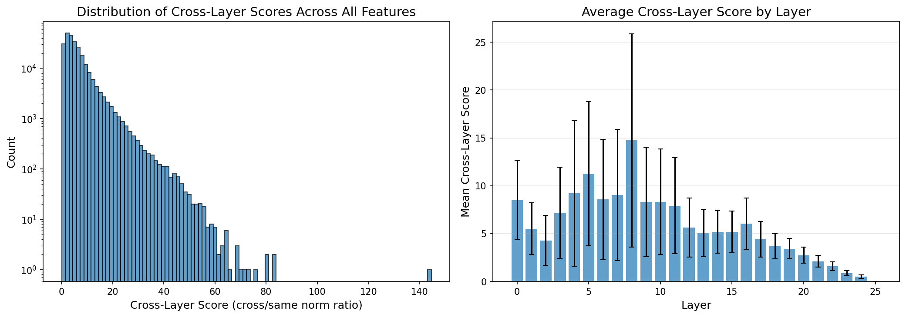
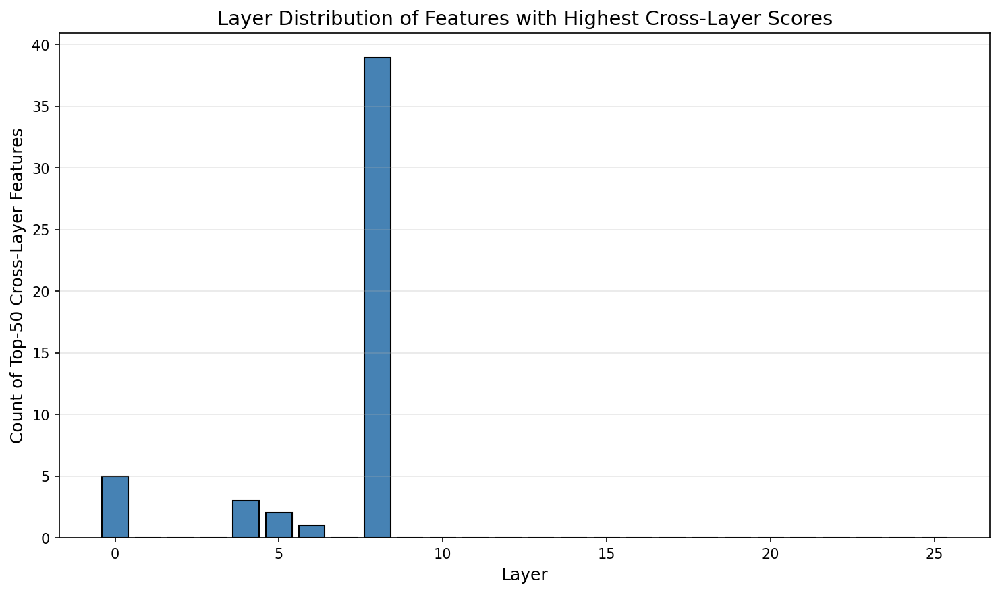

# Cross-Layer Connections in Cross-Layer Transcoders: An Empirical Investigation

**Research Question**: How big a deal are the cross-layer connections in cross-layer transcoders? What are they really doing?

**Model**: Gemma Scope 2 CLTs on Gemma3-1B

---

## Background

Cross-Layer Transcoders (CLTs) are a key component of Anthropic's attribution graphs methodology. Unlike per-layer transcoders, CLTs organize features into L layers matching the model's structure, where each feature at layer ℓ can write to all subsequent MLP outputs (layers ℓ, ℓ+1, ..., L).

From the Anthropic methods paper:
> "An ℓth layer feature contributes to the reconstruction of the MLP outputs in layers ℓ, ℓ+1,…, L, using a separate set of linear decoder weights for each output layer."

This architecture enables **path collapsing** - representing multi-layer amplification chains as single features, reducing average path length from 3.7 to 2.3 in tested examples.

---

## Experiments

### Experiment 1: Cross-Layer Weight Analysis

**Goal**: Quantify how much decoder weight mass is in cross-layer vs same-layer connections.

**Key Findings**:
- Same-layer weight ratio: `[TO BE FILLED]`
- Cross-layer weight ratio: `[TO BE FILLED]`

---

### Experiment 2: Ablation Study

**Goal**: Measure the impact of removing cross-layer connections.

**Key Findings**:
- Full CLT FVU: `[TO BE FILLED]`
- Ablated CLT FVU: `[TO BE FILLED]`
- FVU increase from ablation: `[TO BE FILLED]`

---

### Experiment 3: Feature-Level Analysis

**Goal**: Identify which features rely most on cross-layer connections.

**Top Cross-Layer Features**:
| Layer | Feature | Cross-Layer Score |
|-------|---------|-------------------|
| `[TO BE FILLED]` | | |

---

### Experiment 4: Layer Distance Analysis

**Goal**: Analyze how cross-layer connections vary with layer distance.

**Key Findings**:
- Decay pattern: `[TO BE FILLED]`
- Decay factor (distance 0 to 5): `[TO BE FILLED]`

---

## Conclusions

`[TO BE FILLED AFTER EXPERIMENTS]`

### Implications for Circuit Analysis

`[TO BE FILLED]`

---

## References

1. [Attribution Graphs Methods](https://transformer-circuits.pub/2025/attribution-graphs/methods.html) - Anthropic
2. [Gemma Scope 2 Blog](https://deepmind.google/blog/gemma-scope-2-helping-the-ai-safety-community-deepen-understanding-of-complex-language-model-behavior/) - Google DeepMind
3. [Gemma Scope 2 1B PT on HuggingFace](https://huggingface.co/google/gemma-scope-2-1b-pt)
