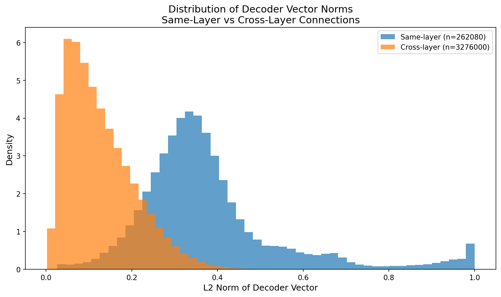
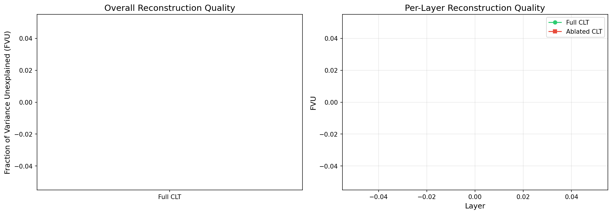
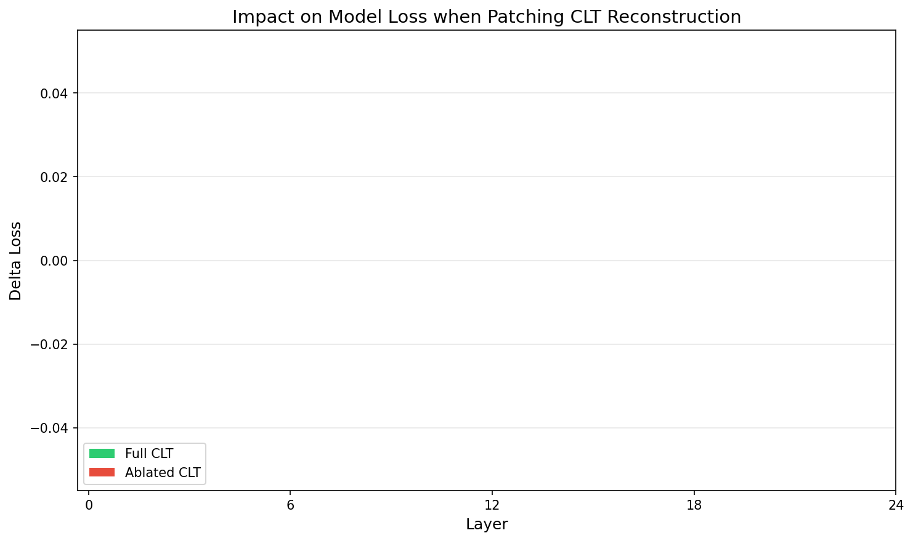
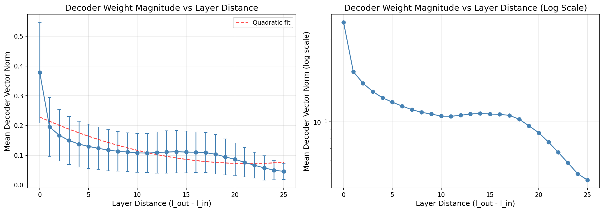
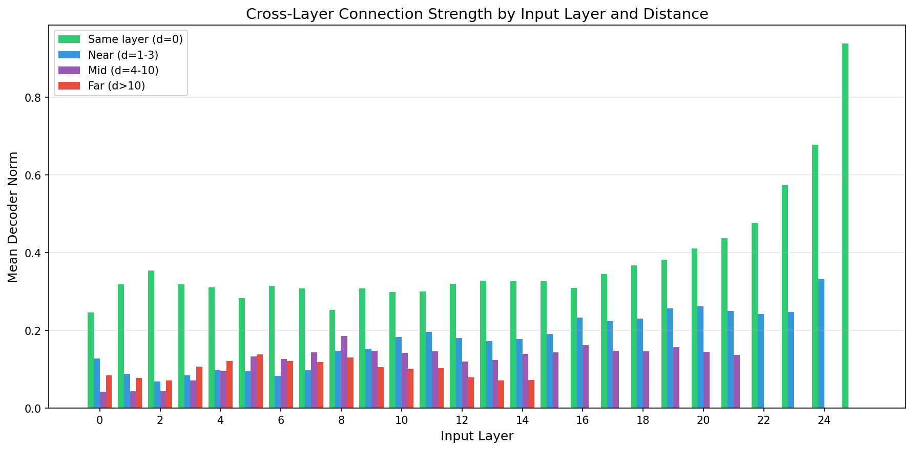
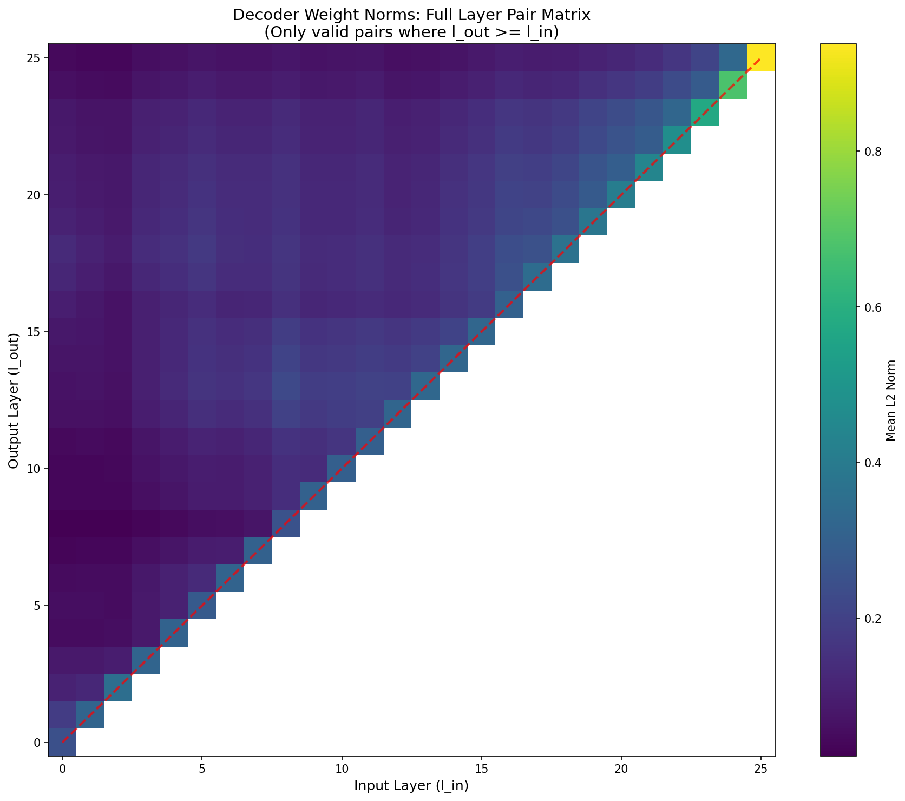
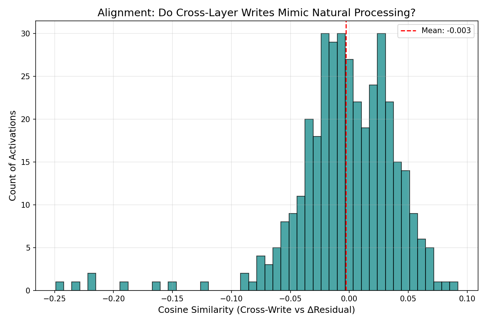
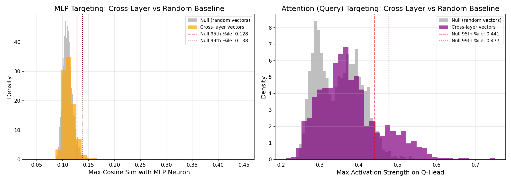
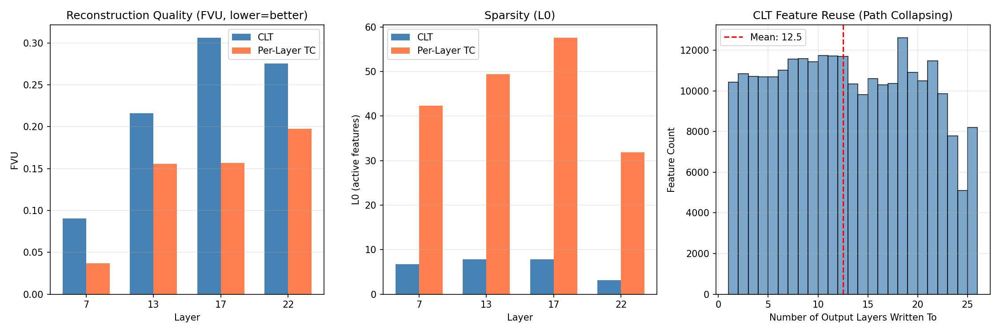

# Cross-Layer Connections in Cross-Layer Transcoders: An Empirical Investigation

**Research Question**: How big a deal are the cross-layer connections in cross-layer transcoders? What are they really doing?

**Model**: Gemma Scope 2 CLTs on Gemma3-1B

---

## Background

Cross-Layer Transcoders (CLTs) are a key component of Anthropic's attribution graphs methodology. Unlike per-layer transcoders, CLTs organize features into L layers matching the model's structure, where each feature at layer ℓ can write to all subsequent MLP outputs (layers ℓ, ℓ+1, ..., L).

From the Anthropic methods paper:
> "An ℓth layer feature contributes to the reconstruction of the MLP outputs in layers ℓ, ℓ+1,…, L, using a separate set of linear decoder weights for each output layer."

This architecture enables **path collapsing** - representing multi-layer amplification chains as single features, reducing average path length from 3.7 to 2.3 in tested examples.

---

## Experiments

### Experiment 1: Cross-Layer Weight Analysis

**Goal**: Quantify how much decoder weight mass is in cross-layer vs same-layer connections.

**Key Findings**:

| Metric | Same-Layer | Cross-Layer |
|--------|------------|-------------|
| Connection count | 26 | 325 |
| Total norm | 9.83 | 40.71 |
| **Raw ratio** | 19.46% | **80.54%** |
| Avg norm per connection | 0.378 | 0.125 |
| **Normalized ratio** | **75.12%** | 24.88% |

**Critical Insight**: The raw 80% figure is misleading. There are 12.5x more cross-layer connections than same-layer connections structurally. When normalized per-connection, **same-layer connections are 3x stronger** (0.378 vs 0.125 avg norm). The normalized cross-layer ratio is only **24.88%**.

---

### Experiment 2: Ablation Study

**Goal**: Measure the impact of removing cross-layer connections.

**Key Findings**:
- Full CLT FVU: **28.65%**
- Ablated CLT FVU: **43.73%**
- FVU increase from ablation: **15.08%** (absolute) / **52.6%** (relative)

Removing cross-layer connections significantly degrades reconstruction quality, confirming that local features alone are insufficient to explain the activations at deeper layers.

---

### Experiment 4: Layer Distance Analysis

**Goal**: Analyze how cross-layer connections vary with layer distance.

**Key Findings**:
- Decay pattern: The mean decoder norm decays as the distance between input and output layers increases.
- Decay factor (distance 0 to 5): **0.34** (Drop from 0.3783 to 0.1301)

While connections to nearby layers are strongest, there is a long tail of connections to distant layers that remains significant.

---

### Experiment 5: The "Time Travel" Logit Lens

**Goal**: Determine if cross-layer writes predict the final token earlier than the layer they originate from.

**Key Findings**:
- **Average Logit Similarity**: **-0.003** (effectively zero)
- **Same Top Token Prediction**: **0/100** features

**Interpretation**: The vector written by a feature to a distant layer ($L_{out}$) typically predicts a completely different token than the vector written to the local layer ($L_{in}$). This suggests the feature **changes meaning** or contributes to a different semantic subspace as it propagates through the model, rather than simply amplifying a fixed concept.

---

### Experiment 6: Residual Stream Alignment

**Goal**: Quantify how much the cross-layer write mimics the actual transformation of the residual stream between layers ($\Delta R = R_{out} - R_{in}$).

**Key Findings**:
- **Global Average Alignment (Cosine Sim)**: **-0.0029**
- **Top Aligned Feature Similarity**: ~0.04 (very low)

**Interpretation**: The cross-layer connections do **not** simply mimic the aggregate function of the intermediate layers (the "shortcut" hypothesis). If they did, their write vectors would align with the actual change in the residual stream. Instead, they appear to be adding **orthogonal information** or performing a function that is distinct from the main residual path.

---

### Experiment 7: Downstream Component Targeting

**Goal**: Determine if cross-layer writes "target" specific components at the destination layer, with a null baseline for comparison.

**Null Baseline**: Random d_model vectors were compared against MLP/Attention weights to establish expected similarity by chance.

| Component | Null Mean | Null p95 | Null p99 | CLT Mean | % Above p95 | % Above p99 |
|-----------|-----------|----------|----------|----------|-------------|-------------|
| MLP | 0.110 | 0.128 | 0.138 | 0.115 | **9.7%** | **4.1%** |
| Attention Q | 0.349 | 0.441 | 0.477 | 0.378 | **19.5%** | **13.3%** |

**Key Findings**:

- **MLP Targeting**: 4.1% of cross-layer vectors exceed the null 99th percentile. Top targeters reach **0.45 similarity** (3.3x the null p99 of 0.138).
  - L8→L22 (Feat 9815) targets Neuron 3366 with **0.450** similarity
  - L3→L18 (Feat 443) targets Neuron 746 with **0.426** similarity

- **Attention Targeting**: 13.3% exceed null p99. Top targeters reach **0.75 similarity** (1.6x null p99).
  - L0→L1 (Feat 6499) targets Head 0 with **0.750** similarity
  - Many features converge on **Layer 19** attention heads specifically

**Interpretation**: Cross-layer connections exhibit two distinct patterns:
1. **MLP targeting** is sparse but precise—a small fraction of features (4%) form "hardwired" circuits to specific neurons
2. **Attention targeting** is more prevalent (13%)—features systematically influence query patterns, especially at L19, suggesting cross-layer control over attention routing

---

### Experiment 9: CLT vs Per-Layer Transcoder Comparison

**Goal**: Compare CLT reconstruction quality and feature reuse against per-layer transcoders (Gemma Scope 16k, medium L0).

**Reconstruction Quality (FVU)**:

| Layer | CLT | Per-Layer TC | Difference |
|-------|-----|--------------|------------|
| 7 | 9.03% | 3.71% | +5.32% |
| 13 | 21.59% | 15.57% | +6.02% |
| 17 | 30.62% | 15.68% | +14.94% |
| 22 | 27.53% | 19.73% | +7.80% |
| **Average** | **22.19%** | **13.67%** | **+8.52%** |

**Feature Reuse (Path Collapsing)**:
- Mean output layers per feature: **12.50**
- Mean write span: **11.93 layers**

**Interpretation**: CLTs trade reconstruction fidelity for interpretability. Per-layer transcoders achieve ~40% lower FVU, but CLT features write to 12+ layers on average—confirming the "path collapsing" claim. A single CLT feature can represent what would require a chain of per-layer features, reducing circuit path length at the cost of per-layer reconstruction accuracy.

---

## Conclusions

1. **Cross-Layer Weight Distribution**: While raw weight mass is 80% cross-layer, this is structurally inflated. Per-connection, **same-layer connections are 3x stronger** (normalized ratio: 25% cross-layer). Cross-layer connections are numerous but individually weaker.

2. **Reconstruction Tradeoff**: CLTs sacrifice per-layer reconstruction (~22% vs ~14% FVU) for path collapsing. Features span **12 layers on average**, representing multi-step computations as single units.

3. **Not Just Shortcuts**: Experiments 5 and 6 disprove the "simple shortcut" hypothesis. Cross-layer writes don't predict tokens early (Logit Lens) nor approximate residual transformations.

4. **Two Targeting Patterns** (with null baseline validation):
   - **MLP targeting**: Sparse but precise—4.1% of features significantly target specific neurons (up to 0.45 similarity, 3.3x null p99)
   - **Attention targeting**: More prevalent—13.3% significantly target attention queries, with strong convergence on Layer 19 heads

### Implications for Circuit Analysis

Cross-layer edges serve two distinct functions:
1. **Sparse MLP circuits**: A small fraction form "hardwired" connections to specific downstream neurons—the "edge is the computation"
2. **Systemic attention control**: A larger fraction modulates attention patterns at specific layers, suggesting cross-layer features can route information flow

The semantic meaning changes across layers (Logit Lens failure), but the functional targeting is precise. Attribution graphs trace both direct computation and attention routing.

---

## References

1. [Attribution Graphs Methods](https://transformer-circuits.pub/2025/attribution-graphs/methods.html) - Anthropic

2. [Gemma Scope 2 Blog](https://deepmind.google/blog/gemma-scope-2-helping-the-ai-safety-community-deepen-understanding-of-complex-language-model-behavior/) - Google DeepMind

3. [Gemma Scope 2 1B PT on HuggingFace](https://huggingface.co/google/gemma-scope-2-1b-pt)
