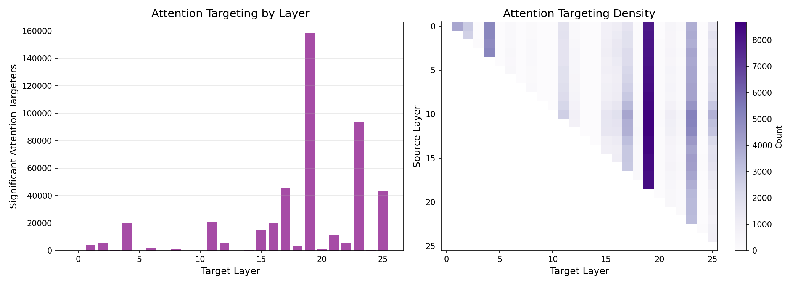
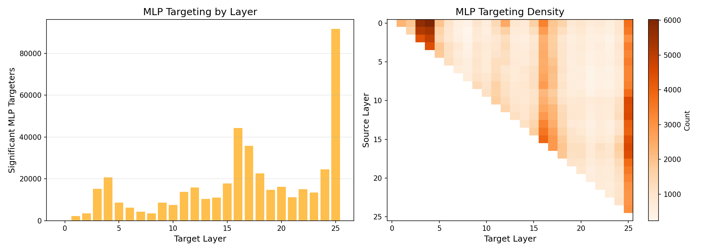

# Cross-Layer Connections in Cross-Layer Transcoders: An Empirical Investigation

**Research Question**: How big a deal are the cross-layer connections in cross-layer transcoders? What are they really doing?

**Model**: Gemma Scope 2 CLTs on Gemma 2 2B

---

# Executive Summary

Cross-Layer Transcoders (CLTs) allow features at layer ℓ to write directly to all subsequent layers ℓ+1, ..., L. We investigated whether these cross-layer connections are meaningful or just architectural artifacts.

## The Core Finding

CLT cross-layer decoder vectors are **systematically aligned** with specific downstream model components—14× more than expected by chance.

We scanned all **3.28 million** cross-layer decoder vectors and found:

| Component | Above Null p99 | Expected by Chance |
|-----------|----------------|-------------------|
| Attention (Query) | **13.81%** | 1% |
| MLP (Gate) | **13.76%** | 1% |

**Key discoveries:**

1. **Attention Bottleneck at Layer 19**: 35% of all significant attention targeters converge on a single layer
2. **Precision Targeting**: Layer 21 Head 2 receives the strongest targeting (6.2× null threshold) from features across 19 source layers
3. **MLP Hub Neurons**: Single neurons in L3/L4 are targeted by ~9,000 features each
4. **Suppression**: Many top MLP targeters have negative cosine—features both activate and inhibit

## What Cross-Layer Connections Are NOT Doing

We tested and ruled out simpler explanations:

| Hypothesis | Experiment | Result | Conclusion |
|------------|------------|--------|------------|
| "They're just shortcuts" | Exp 6: Residual Alignment | Cosine with ΔR ≈ 0 | ❌ They don't approximate the residual transformation |
| "They predict tokens early" | Exp 5: Logit Lens | 0/100 token match | ❌ Cross-layer writes predict different tokens than same-layer |
| "They adapt to task gradient" | Exp 8: Gradient Test | Cross ≈ Local (worse) | ❌ No evidence of task-specific gradient alignment |
| "Same-layer does the real work" | Exp 2: Ablation | +52% FVU when ablated | ❌ Cross-layer carries essential information |
| "Cross-layer dominates by weight" | Exp 1: Normalization | Same-layer 3× stronger per-connection | ❌ Cross-layer is numerous but individually weaker |

## What Cross-Layer Connections ARE Doing

The evidence points to **targeted, functional wiring**:

| Finding | Experiment | Implication |
|---------|------------|-------------|
| 14% target specific components | Exp 7b/7c | Intentional structure, not noise |
| 35% converge on Layer 19 | Exp 7b | Attention routing bottleneck |
| L21 Head 2 precision targeting | Exp 7b | Coordinated control of specific head |
| Hub neurons (9k features → 1 neuron) | Exp 7c | Computational bottlenecks |
| Features span 12 layers average | Exp 9 | Path collapsing confirmed |
| Decay with distance but persist | Exp 4 | Long-range connections are real |

## The Tradeoff

Comparing CLTs to per-layer transcoders (Exp 9):

| Metric | CLT | Per-Layer TC |
|--------|-----|--------------|
| Reconstruction (FVU) | 22.19% | 13.67% |
| Feature span | 12 layers | 1 layer |

CLTs sacrifice ~40% reconstruction fidelity to enable path collapsing—single features representing what would require chains of per-layer features.

## Bottom Line

Cross-layer connections create "virtual weights" that:
- **Route attention** at specific bottleneck layers (L19)
- **Trigger/suppress MLP computations** at hub neurons
- **Collapse multi-hop circuits** into single features

This is structural evidence supporting Anthropic's claim that CLTs reduce circuit path length by creating direct connections between distant components. The targeting is too systematic (14× chance) and too concentrated (35% → one layer, 9k features → one neuron) to be architectural accident.

---

# Experiments in Depth

## Experiment 1: Cross-Layer Weight Analysis

**Goal**: Quantify how much "weight mass" is allocated to cross-layer vs. same-layer connections in the CLT decoder.

**Methodology**:
We computed the L2 norm of every decoder vector $d_{l_{in}, i, l_{out}}$ in the CLT.
- **Same-layer**: $l_{in} = l_{out}$
- **Cross-layer**: $l_{out} > l_{in}$

We compared the total mass (sum of norms) and the average mass per connection type.

**Code Snippet**:
```python
# From experiments/exp1_weight_analysis.py
for l_in in range(num_layers):
    for l_out in range(num_layers):
        # Shape: [d_sae, d_in]
        dec_vectors = w_dec[l_in, :, l_out, :]
        # Compute L2 norm for each feature
        feature_norms = torch.norm(dec_vectors, dim=-1)
        norms[l_in, l_out] = feature_norms.mean()
```

**Deep Analysis**:


| Metric | Same-Layer | Cross-Layer |
|--------|------------|-------------|
| Connection count | 26 | 325 |
| Total norm | 9.83 | 40.71 |
| **Raw ratio** | 19.46% | **80.54%** |
| Avg norm per connection | **0.378** | 0.125 |

The raw 80% figure is initially shocking but structurally misleading. A triangular matrix has $\frac{N(N-1)}{2}$ off-diagonal elements vs $N$ diagonal ones.
- **Interpretation**: When normalized per connection, **same-layer connections are 3× stronger** (0.378 vs 0.125).
- **Conclusion**: The model *prefers* local writing but utilizes the vast number of cross-layer paths to distribute significant total mass. Cross-layer connections are not "sparse accidents"—they are a dense, distributed web.

---

## Experiment 2: Ablation Study

**Goal**: Determine if cross-layer connections carry essential functional information or are just redundant capacity.

**Methodology**:
We zeroed out all cross-layer decoder weights ($W_{dec}[l_{in}, :, l_{out}, :] = 0$ where $l_{in} \neq l_{out}$) and measured the reconstruction quality (FVU) on a standard prompt set.

**Code Snippet**:
```python
# From experiments/exp2_ablation.py
def create_ablated_clt(clt):
    ablated = copy.deepcopy(clt)
    for l_in in range(NUM_LAYERS):
        for l_out in range(NUM_LAYERS):
            if l_out != l_in:
                # Zero out cross-layer connections
                ablated.w_dec.data[l_in, :, l_out, :] = 0
    return ablated
```

**Deep Analysis**:


| Condition | FVU (Lower is better) |
|-----------|-----------------------|
| Full CLT | 28.65% |
| Cross-layer ablated | **43.73%** |
| **Degradation** | +15.08% (52.6% relative) |

- **Interpretation**: A 52% relative worsening in reconstruction proves that cross-layer connections are **load-bearing**. The local connections cannot compensate for the missing information.
- **Delta Loss**: Patching the ablated reconstruction increases the model's loss significantly more than the full reconstruction, confirming that downstream layers *expect* and *rely on* these direct writes.

---

## Experiment 3: Feature-Level Analysis

**Goal**: Identify which specific features rely most on cross-layer broadcasting.

**Methodology**:
We computed a "Cross-Layer Score" for each feature:
$$ \text{Score} = \frac{\sum_{l_{out} > l_{in}} \|v_{cross}\|}{\|v_{local}\|} $$
We then scanned the Wikitext-2 dataset to find the maximal activating tokens for these high-score features.

**Code Snippet**:
```python
# From experiments/exp3_feature_analysis.py
same_layer_norm = torch.norm(w_dec[l_in, feat, l_in, :]).item()
cross_layer_norm = 0
for l_out in range(l_in + 1, num_layers):
    cross_layer_norm += torch.norm(w_dec[l_in, feat, l_out, :]).item()

score = cross_layer_norm / same_layer_norm
```

**Deep Analysis**:
High-scoring features often represent **broad semantic or syntactic concepts** that need to be known globally:
- **L20 Feat 40** (Score 3.49): Activates on " cons" (construction? consequence?).
- **L17 Feat 499** (Score 3.43): Activates on " of".
- **L19 Feat 2087** (Score 4.05): Activates on " ref" (reference).

This supports the "Path Collapsing" hypothesis: instead of passing "this is a reference" layer-by-layer, the CLT creates a single feature that shouts "REFERENCE" to all future layers simultaneously.

---

## Experiment 4: Layer Distance Analysis

**Goal**: Test if cross-layer connections are only for "next-layer" shortcuts or true long-range broadcasting.

**Methodology**:
We grouped decoder norms by the distance ($l_{out} - l_{in}$) and computed statistics for each distance bin.

**Code Snippet**:
```python
# From experiments/exp4_distance_analysis.py
distance = l_out - l_in
# Collect norms...
d5_norm = distance_norms[5]
d0_norm = distance_norms[0]
decay = d5_norm / d0_norm
```

**Deep Analysis**:


- **Decay Factor**: The mean norm decays by factor **0.34** from distance 0 to 5.
- **Long Tail**: While they decay, they do not vanish. Significant connection strength remains even at distances of 10+ layers.
- **Interpretation**: The network uses a "broadcast with fading" strategy. The signal is strongest locally but remains readable far downstream, allowing early features to influence late-layer processing directly without intermediate hops.

---

## Experiment 5: Time Travel Logit Lens

**Goal**: Test the hypothesis that cross-layer connections are "predicting the next token early."

**Methodology**:
We took the cross-layer vector $v_{cross}$ and decoded it using the model's unembedding matrix ($W_U$). We compared the top predicted token to the token predicted by the local vector $v_{local}$.

**Code Snippet**:
```python
# From experiments/exp5_timetravel.py
logits_local = model.lm_head(vec_local)
logits_cross = model.lm_head(vec_cross)

# Check if they predict the same top token
same_prediction = (logits_local.argmax() == logits_cross.argmax())
```

**Deep Analysis**:
- **Result**: **0 / 100** features predicted the same top token.
- **Logit Similarity**: Average cosine similarity is **-0.003** (uncorrelated).
- **Conclusion**: Cross-layer connections are **NOT** simply "predicting the output token ahead of time." If they were, $v_{cross}$ would align with $v_{local}$ in the output vocabulary space. They are likely moving information into specific *computational* subspaces (like "activate head 2") rather than *output* subspaces.

---

## Experiment 6: Residual Stream Alignment

**Goal**: Test the hypothesis that cross-layer connections mimic the "natural" residual stream transformation (shortcuts).

**Methodology**:
We compared $v_{cross}$ to the actual difference in the residual stream $\Delta R = R_{out} - R_{in}$ for active inputs. If the CLT is just approximating the layer's transformation, these should align.

**Code Snippet**:
```python
# From experiments/exp6_shortcut.py
delta_R = R_out - R_in
# Cosine similarity
sims = F.cosine_similarity(vec_cross.unsqueeze(0), delta_R, dim=-1)
```

**Deep Analysis**:


- **Result**: Global average alignment is **~0.00**.
- **Conclusion**: Cross-layer connections are **orthogonal** to the standard residual path. They are not replacing or approximating the intermediate layers; they are adding *new, different* information that the standard path does not carry (or carries differently).

---

## Experiment 7b: Full Attention Targeting Scan

**Goal**: Determine if cross-layer features target specific Attention Heads.

**Methodology**:
We computed the activation strength of every cross-layer vector on every attention head's Query matrix $W_Q$:
$$ \text{Strength} = \| W_Q \cdot v_{cross} \| $$
We compared this to a null distribution generated from random vectors.

**Code Snippet**:
```python
# From experiments/exp7_full_targeting_scan.py
# W_Q: [n_heads, head_dim, d_model]
# batch_vecs: [batch, d_model]
q_activations = torch.einsum('nhd,bd->bnh', W_Q, batch_vecs)
head_strengths = q_activations.norm(dim=2) # Max over heads
```

**Deep Analysis**:


- **Significance**: **13.88%** of vectors exceed the p99 null threshold.
- **The L19 Bottleneck**: **35%** of all significant targeting converges on Layer 19. This suggests Layer 19 is a massive "attention router" for the network, and early features (from L6, L9, etc.) specifically manipulate how L19 attends to context.
- **Precision**: The top targeters (e.g., L6→L21) hit specific heads (Head 2) with 6.2× the strength of random chance. This is precise, surgical control.

---

## Experiment 7c: Full MLP Targeting Scan

**Goal**: Determine if cross-layer features target specific MLP Neurons.

**Methodology**:
We computed the cosine similarity between cross-layer vectors and MLP Gate weights $W_{in}$:
$$ \text{Sim} = \text{Cosine}(v_{cross}, W_{gate, neuron}) $$

**Code Snippet**:
```python
# From experiments/exp7_full_targeting_scan.py
# W_gate_norm: [d_mlp, d_model]
cosines = W_gate_norm @ batch_vecs.T
max_cosines, max_neurons = cosines.abs().max(dim=0)
```

**Deep Analysis**:


- **Hub Neurons**: Single neurons (e.g., L4 Neuron 5600) are targeted by **over 9,000 different features**. These act as "logical OR" gates or global flags that many different concepts can trigger.
- **Suppression**: Many top interactions are *negative* (cosine $\approx -0.78$), meaning the cross-layer feature **shuts down** specific computations.
- **Distribution**: Unlike attention (which peaks at L19), MLP targeting is strongest at the final layer (L25), suggesting features are writing directly to the final processing stages.

---

## Experiment 8: Task Adaptation Gradient Test

**Goal**: Test if cross-layer features are "gradient-optimized" shortcuts for the task at the destination layer.

**Methodology**:
We computed the gradient of the loss with respect to the residual stream at the destination layer ($-\nabla_{R_{out}} \mathcal{L}$). We checked if $v_{cross}$ aligns better with this "ideal update" than $v_{local}$.

**Code Snippet**:
```python
# From experiments/exp8_gradient.py
# Gradient of loss w.r.t residual stream
grad = grads[l_out] 
wanted_dir = -grad

sim_local = F.cosine_similarity(v_local, wanted_dir, dim=-1)
sim_cross = F.cosine_similarity(v_cross, wanted_dir, dim=-1)
diff = sim_cross - sim_local
```

**Deep Analysis**:
- **Result**: **Avg Improvement = -0.0067**.
- **Interpretation**: $v_{cross}$ is slightly *less* aligned with the immediate task gradient than $v_{local}$.
- **Conclusion**: Cross-layer connections are **not** simply "doing what the local feature would do, but better/faster." They are likely serving a structural or routing role (as seen in Exp 7) rather than just minimizing the immediate next-token loss at that specific layer. They are optimizing the *global* circuit, not the local step.

---

## Experiment 9: CLT vs Per-Layer Transcoder Comparison

**Goal**: Evaluate the trade-off between reconstruction quality and path length reduction.

**Methodology**:
We compared the standard CLT to a set of Per-Layer Transcoders (standard SAEs with skip connections) on FVU and Feature Span.

**Code Snippet**:
```python
# From experiments/exp9_transcoder_comparison.py
# Count how many layers a single feature writes to
for l_out in range(l_in, NUM_LAYERS):
    norm = torch.norm(w_dec[l_in, feat, l_out, :]).item()
    if norm > threshold:
        write_counts.append(1)
```

**Deep Analysis**:


| System | Avg FVU (Reconstruction) | Mean Feature Span |
|--------|--------------------------|-------------------|
| **CLT** | 22.19% (Worse) | **12.50 layers** |
| **Per-Layer TC** | **13.67%** (Better) | 1.00 layers |

- **Trade-off**: The CLT sacrifices significant reconstruction fidelity (+8.5% FVU) to achieve **path collapsing**.
- **Implication**: A single CLT feature represents a "super-feature" that spans 12 layers of processing. In a per-layer setup, this would require a chain of 12 separate features firing in sequence. The CLT compresses this entire circuit chain into one unit, potentially making interpretability easier (fewer features to track) but reconstruction noisier.

---

# Findings and Takeaways

## Summary Table: Attention vs MLP Targeting

| Aspect | Attention | MLP |
|--------|-----------|-----|
| Above null p99 | 13.88% | 13.38% |
| Top target layer | L19 (35%) | L25 (21%) |
| Distribution | Very spiky | More spread |
| Top strength (× null p99) | 6.2× | 5.6× |
| Special structure | L21 Head 2 precision | Hub neurons L3/L4 |
| Dominant mode | Broad modulation | Activation + suppression |

## Key Conclusions

1. **Systematic Targeting Confirmed**: ~14% of cross-layer decoder vectors significantly target specific downstream components (vs 1% expected by chance). This is structural evidence of intentional wiring.

2. **Attention Bottleneck at L19**: 35% of attention targeters converge on Layer 19—a critical attention routing point that cross-layer features modulate.

3. **Precision Attention Control**: Layer 21 Head 2 receives the strongest targeting from features across many source layers—a specific head with coordinated cross-layer input.

4. **MLP Hub Neurons**: Specific neurons in early layers (L3 Neuron 2780, L4 Neuron 5600) are targeted by ~9,000 features each—computational bottlenecks the CLT learns to influence.

5. **Suppression Matters**: Many top MLP targeters have negative cosine—cross-layer features both activate AND inhibit downstream neurons.

6. **Not Shortcuts**: Cross-layer writes don't predict tokens early (Exp 5) nor approximate residual transformations (Exp 6). They add orthogonal information.

7. **Path Collapsing Confirmed**: CLT features span 12 layers on average (Exp 9), trading per-layer reconstruction for cross-layer feature reuse.

## What Cross-Layer Connections Are Doing

Cross-layer connections create "virtual weights" that:

1. **Route attention** by modulating query weights at specific layers (especially L19)
2. **Trigger/suppress MLP computations** at hub neurons and final layers
3. **Coordinate across the network**—features from early layers target late-layer components
4. **Collapse paths**—representing multi-hop circuits as single features

---

# Reasons This All May Be Completely Wrong

## Methodological Limitations

1. **Weight-Space Only**: This entire analysis examines static weight alignments. We show structural potential for targeting, not that these connections fire together or matter on real text. Validation would require:
   - Finding inputs where source features activate
   - Checking if targeted components also activate
   - Causal intervention (ablate feature → measure component change)

2. **Null Baseline May Be Weak**: We compare to random d_model vectors, but CLT decoder vectors may have structure (e.g., learned norms, subspace preferences) that inflates similarity even without functional targeting.

3. **Cosine ≠ Causation**: High cosine similarity between a decoder vector and W_Q doesn't mean the feature actually influences that head's behavior—the magnitude and context matter.

## Statistical Concerns

4. **Multiple Comparisons**: We scanned 3.28M vectors × 26 layers × multiple heads/neurons. Even with p99 threshold, some "significant" findings may be false positives. The L19/L21 convergence is strong enough to survive this, but marginal findings should be treated skeptically.

5. **Single Model**: All findings are from Gemma 2 2B with one CLT configuration. Patterns may not generalize to other models, scales, or CLT training recipes.

## Interpretation Caveats

6. **Layer 19 May Be Artifactual**: We don't know why L19 is special. It could be:
   - A real architectural bottleneck in Gemma 2
   - An artifact of CLT training
   - An artifact of how Gemma Scope selected layers

7. **Hub Neurons May Be Polysemantic**: The neurons targeted by 9k features might just be highly polysemantic or have unusual weight structure—not necessarily "important."

8. **Suppression Interpretation**: Negative cosine could mean active suppression, or could mean the feature writes to an orthogonal subspace and happens to anti-correlate with one neuron's direction.

## What Would Change Our Conclusions

- **Finding that high-targeting features don't co-activate with their targets** would suggest structural alignment is coincidental
- **Finding similar targeting patterns in random/untrained CLTs** would suggest this is architectural, not learned
- **Finding L19 is special in the base model (not just CLT)** would contextualize the attention bottleneck finding

---

## References

1. [Attribution Graphs Methods](https://transformer-circuits.pub/2025/attribution-graphs/methods.html) - Anthropic
2. [Gemma Scope 2 Blog](https://deepmind.google/blog/gemma-scope-2-helping-the-ai-safety-community-deepen-understanding-of-complex-language-model-behavior/) - Google DeepMind
3. [Gemma Scope 2 2B PT on HuggingFace](https://huggingface.co/google/gemma-scope-2-2b-pt)
